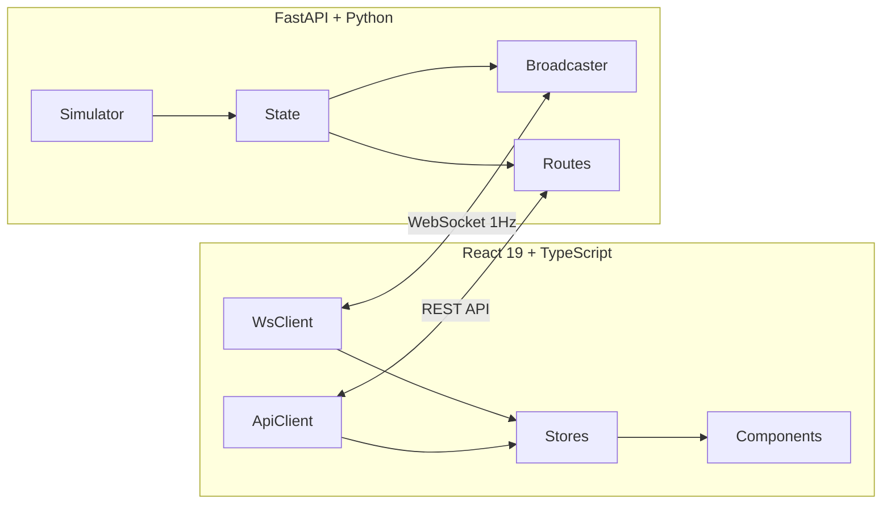

# Complete Gap Implementation Plan — KTZ Digital Twin

## Context

This is a hackathon project ("Digital Twin: Locomotive Telemetry Visualization") with evaluation weights:
- **Realtime visualization (35%)**: streaming, health index, noise filtering, spike handling
- **UI/UX (30%)**: interactive charts, map, replay, theme, explainability
- **Backend architecture (25%)**: API, configurable thresholds, auth, Docker, persistence
- **Demo quality (10%)**: architecture diagram, load scenario, export

The project already has a working React 19 dashboard (6 pages, 5 stores, WebSocket streaming) and FastAPI backend (11 endpoints, physics-based simulator, 14 metrics, 6 subsystems). The diagram page, alerts, messages, and telemetry views are fully implemented. What follows are all the remaining gaps, organized by implementation priority.

---

## CRITICAL PREREQUISITE: Restore Missing Route Source Files

**Problem**: `back_locomotive/app/routes/` only contains `__init__.py` — the 6 route modules (alerts, connection, health, messages, replay, telemetry) exist **only** as `.pyc` compiled bytecode in `__pycache__/`. The backend runs fine from bytecode, but we cannot modify routes without source files.

**Action**: Decompile the `.pyc` files using `uncompyle6` or `decompyle3`, OR reconstruct from the known API contract (endpoints.ts + models.py + exploration knowledge). Place restored `.py` files in `app/routes/`.

**Files to restore** (6):
- `app/routes/health.py` — `GET /api/health`
- `app/routes/telemetry.py` — `GET /api/telemetry/current`, `/metrics`, `/history/{id}`
- `app/routes/alerts.py` — `GET /api/alerts`, `POST /api/alerts/{id}/acknowledge`
- `app/routes/messages.py` — `GET /api/messages`, `POST /api/messages/{id}/read`, `POST /api/messages/{id}/acknowledge`
- `app/routes/connection.py` — `GET /api/connection/status`
- `app/routes/replay.py` — `GET /api/replay/snapshot`

---

## PHASE 1 — High-Impact Realtime (targets 35% criteria)

### 1.1 Client-side Noise Smoothing

**Why**: The physics simulator adds `random.gauss()` noise to every metric every second. Raw display causes visual jitter. "Noise filtering" is explicitly scored.

**Backend**: No changes.

**Frontend changes**:

1. **New: `src/utils/smoothing.ts`**
   - `ema(prev: number, next: number, alpha: number): number` — single-step EWM
   - Default alpha = 0.3 (responsive but smooth)

2. **New: `src/features/settings/useSettingsStore.ts`** (Zustand, follows existing pattern)
   - State: `{ smoothingEnabled: boolean; smoothingAlpha: number }`
   - Actions: `toggleSmoothing()`, `setAlpha(n)`
   - Defaults: `{ smoothingEnabled: true, smoothingAlpha: 0.3 }`

3. **Modify: `src/features/telemetry/useTelemetryStore.ts`**
   - Add `smoothedReadings: Map<string, MetricReading>` to state
   - In `applyFrame()`, after updating `currentReadings`, compute `ema(prevSmoothed, raw, alpha)` for each reading
   - Raw `currentReadings` preserved untouched for fidelity

4. **Modify: `src/components/metrics/DynamicMetricRenderer.tsx`**
   - Read `smoothingEnabled` from settings store
   - If enabled, display from `smoothedReadings` instead of `currentReadings`

5. **Modify: `src/components/layout/TopBar.tsx`**
   - Add smoothing toggle icon button (e.g., `Waves` from lucide) after connection indicators
   - Reads/toggles `useSettingsStore`

### 1.2 Chart Zoom (dataZoom)

**Why**: "Interactive charts" is explicitly scored in UI/UX (30%).

**Frontend changes**:

1. **Modify: `src/components/charts/LineChart.tsx`** (currently 70 lines)
   - Add `dataZoom` to ECharts options:
     ```
     dataZoom: [
       { type: 'inside', xAxisIndex: 0 },
       { type: 'slider', xAxisIndex: 0, height: 20, bottom: 4,
         borderColor: '#334155', fillerColor: 'rgba(96,165,250,0.15)',
         handleStyle: { color: '#60a5fa' } }
     ]
     ```
   - Adjust grid bottom from 40 → 64 to accommodate slider
   - No changes to Sparkline (too small for zoom)

2. **New: `src/components/charts/TimeRangeSelector.tsx`**
   - Row of preset buttons: 1m, 5m, 15m, 1h, All
   - Each dispatches ECharts `dispatchAction` to set dataZoom range
   - Styled as small pill-toggle buttons matching dark theme

3. **Modify: `src/pages/TelemetryPage.tsx`** (if LineCharts are used here)
   - Add `<TimeRangeSelector>` above chart area

---

## PHASE 2 — Health Explainability (targets 35% + 30% criteria)

### 2.1 Health Index Explainability

**Why**: "Health index explainability" and "top contributing factors" are explicitly required by the case.

**Backend changes**:

1. **Modify: `app/models.py`** — add new model:
   ```python
   class SubsystemPenalty(CamelModel):
       metric_id: str
       metric_label: str
       current_value: float
       threshold_type: str          # "warningLow" | "warningHigh" | "criticalLow" | "criticalHigh"
       threshold_value: float
       penalty_points: float
   ```
   Add to `SubsystemHealth`: `penalties: list[SubsystemPenalty] = Field(default_factory=list)`
   Add to `HealthIndex`: `top_factors: list[SubsystemPenalty] = Field(default_factory=list)`

2. **Modify: `app/simulator/health.py`**
   - Refactor `_threshold_penalty()` to return `(penalty, threshold_type, threshold_value)` tuple
   - In `generate_health_index()`, collect penalties per subsystem into `SubsystemPenalty` objects
   - Attach to each `SubsystemHealth.penalties`
   - Sort all penalties descending by `penalty_points`, take top 5, attach to `HealthIndex.top_factors`

**Frontend changes**:

3. **Modify: `src/types/health.ts`**
   - Add `SubsystemPenalty` interface
   - Add `penalties?: SubsystemPenalty[]` to `SubsystemHealth`
   - Add `topFactors?: SubsystemPenalty[]` to `HealthIndex`

4. **Modify: `src/services/adapters/healthAdapter.ts`**
   - Extend `adaptSubsystem` and `adaptHealthIndex` to map the new penalty fields

5. **New: `src/components/metrics/HealthExplainer.tsx`**
   - "Contributing Factors" card showing top penalties
   - Each row: metric label, current value, breach indicator (arrow up/down), penalty points
   - Color: critical = red-400, warning = amber-400

6. **Modify: `src/pages/DashboardPage.tsx`**
   - Insert `<HealthExplainer>` below the HealthGauge/subsystems section

---

## PHASE 3 — Replay Page (targets 35% + 30% criteria)

### 3.1 Replay / History UI

**Why**: The replay page is a 16-line stub. The backend already stores 1hr of data in `state.history_buffer` (per-metric deques, maxlen=3600).

**Backend changes**:

1. **Modify: `app/routes/replay.py`** (must be restored from .pyc first)
   - Fix `GET /api/replay/snapshot?timestamp=<ms>` to actually use the timestamp — binary-search `state.history_buffer` for nearest entries
   - Add `GET /api/replay/timeRange` — returns `{ earliest, latest }` ms bounds from buffer
   - Add `GET /api/replay/range?from=<ms>&to=<ms>` — returns all buffer entries within range for all metrics

2. **Modify: `app/state.py`**
   - Add `health_history: deque[tuple[int, dict]] = deque(maxlen=720)` for health snapshots at 5s intervals
   - Health history populated in `health.py` → `generate_health_index()`

3. **Register new endpoints in `app/main.py`** (already includes `replay.router`)

**Frontend changes**:

4. **New: `src/features/replay/useReplayStore.ts`** (Zustand)
   - State: `isPlaying`, `playbackSpeed` (1|2|5|10), `currentTimestamp`, `timeRange`, `historicalData: Map<string, {timestamp,value}[]>`
   - Actions: `play()`, `pause()`, `setSpeed()`, `seekTo()`, `loadHistory()`
   - Playback: when `isPlaying`, advance `currentTimestamp` by `playbackSpeed * 1000` per real second via `setInterval`

5. **New: `src/services/api/replayEndpoints.ts`**
   - `fetchTimeRange()`, `fetchHistoryRange(from, to)`, `fetchSnapshot(ts)`

6. **New: `src/components/replay/PlaybackControls.tsx`**
   - Play/Pause toggle, speed buttons (1x/2x/5x/10x), timestamp display, skip ±10s
   - Icons: `Play`, `Pause`, `SkipForward`, `SkipBack`, `FastForward` from lucide

7. **New: `src/components/replay/TimelineScrubber.tsx`**
   - Full-width range input styled for dark theme
   - Shows tick marks at 5-minute intervals
   - Dragging calls `replayStore.seekTo(ts)`

8. **New: `src/components/replay/ReplayChart.tsx`**
   - Wraps `LineChart` with a vertical `markLine` at `currentTimestamp`
   - Shows warning/critical threshold reference lines via ECharts `markArea`

9. **Rewrite: `src/pages/ReplayPage.tsx`** (replace 16-line stub)
   - Layout: time range bar (top) → transport controls → timeline scrubber → 2-column chart grid → metric selector sidebar
   - On mount: fetch `timeRange`, then `fetchHistoryRange` for the full available window
   - Metric checkboxes grouped by metric group, defaulting to sparkline-enabled metrics

---

## PHASE 4 — Backend Architecture (targets 25% criteria)

### 4.1 Configurable Thresholds

**Why**: "Configurable without recompilation" is explicitly required.

**Backend changes**:

1. **New: `app/thresholds.json`**
   - JSON file containing all metric thresholds and health penalty config
   - Structure: `{ "metrics": { "motion.speed": { "warningHigh": 140 } }, "penalties": { "warning": 5.0, "critical": 15.0 }, "healthStatus": { "normal": 80, "degraded": 60, "warning": 40 } }`

2. **Modify: `app/config.py`**
   - Add `load_thresholds()` function: reads `thresholds.json` (path from env `THRESHOLDS_FILE`), overlays onto `METRIC_DEFINITIONS`, rebuilds `METRIC_BY_ID`
   - Called at module init (fallback to hardcoded if file missing)

3. **New: `app/routes/config_routes.py`**
   - `GET /api/config/thresholds` — returns current thresholds
   - `PUT /api/config/thresholds` — partial update, validates, writes to file, reloads
   - Register in `main.py`

**Frontend changes** (minimal for demo):

4. **Add to `src/services/api/endpoints.ts`**:
   - `config.getThresholds()`, `config.updateThresholds(data)`

### 4.2 Docker Compose

**Why**: "Docker" is explicitly scored.

1. **New: `back_locomotive/Dockerfile`**
   ```dockerfile
   FROM python:3.10-slim
   WORKDIR /app
   COPY requirements.txt .
   RUN pip install --no-cache-dir -r requirements.txt
   COPY app/ app/
   EXPOSE 3001
   CMD ["uvicorn", "app.main:app", "--host", "0.0.0.0", "--port", "3001"]
   ```

2. **New: `front_locomotive/Dockerfile`** (multi-stage)
   - Stage 1: `node:20-alpine` → npm ci → npm run build
   - Stage 2: `nginx:alpine` → copy dist → copy nginx.conf
   - Build args for API URL injection

3. **New: `front_locomotive/nginx.conf`**
   - Serve static files from `/usr/share/nginx/html`
   - Proxy `/api/` → `http://backend:3001/api/`
   - Proxy `/ws` → `ws://backend:3001/ws` with upgrade headers

4. **New: `docker-compose.yml`** (repo root)
   ```yaml
   services:
     backend:
       build: ./back_locomotive
       ports: ["3001:3001"]
     frontend:
       build: ./front_locomotive
       ports: ["8080:80"]
       depends_on: [backend]
   ```

5. **New: `.dockerignore`** files in both service directories

### 4.3 Authentication (Lightweight)

**Why**: Demonstrates security awareness. Quick to add via FastAPI dependency injection.

1. **New: `app/auth.py`**
   - API key dependency: `verify_api_key(x_api_key: str = Header())` raising 401 if mismatch
   - Key from env `API_KEY` defaulting to `"ktz-demo-key-2024"`

2. **Modify: `app/main.py`**
   - Apply `verify_api_key` as global dependency (exclude `/ping`, WebSocket)
   - WS auth: validate `?apiKey=...` query param in `ws/handler.py` during accept

3. **Modify: `src/services/api/apiClient.ts`** — add `X-API-Key` header
4. **Modify: `src/services/websocket/wsClient.ts`** — append `?apiKey=...` to WS URL
5. **Modify: `src/config/app.config.ts`** — add `API_KEY` from `VITE_API_KEY` env

---

## PHASE 5 — Export (targets 10% + 30% criteria)

### 5.1 Report Export (CSV + PDF)

**Backend changes**:

1. **New: `app/routes/export.py`**
   - `GET /api/export/telemetry/csv` — streams history buffer as CSV via `StreamingResponse`
   - `GET /api/export/alerts/csv` — exports alerts as CSV
   - Register in `main.py`

**Frontend changes**:

2. **New: `src/utils/exportCsv.ts`**
   - Client-side CSV from sparkline buffers: constructs CSV string, creates Blob, triggers download via `<a>` click

3. **New: `src/utils/exportPdf.ts`**
   - Zero-dependency approach: open new window with styled HTML health report, trigger `window.print()`
   - Content: health score, subsystem breakdown, active alerts, top penalties

4. **New: `src/components/common/ExportMenu.tsx`**
   - Dropdown with "Export CSV" and "Print Report" options
   - Uses lucide `Download` icon

5. **Modify: `src/pages/TelemetryPage.tsx`** — add ExportMenu (CSV)
6. **Modify: `src/pages/DashboardPage.tsx`** — add ExportMenu (PDF)
7. **Modify: `src/pages/AlertsPage.tsx`** — add ExportMenu (CSV)

---

## PHASE 6 — Documentation & Demo Quality (targets 10% criteria)

### 6.1 Root README

**New: `/README.md`** at repo root with:
- Project overview (1 paragraph)
- Tech stack table
- Architecture overview paragraph
- Quick start (npm/pip/Docker)
- API endpoints table
- WebSocket message types
- Evaluation criteria mapping
- Screenshots section

**Overwrite: `front_locomotive/README.md`** — replace Vite boilerplate with project-specific setup

### 6.2 Architecture Diagram

**New: `docs/architecture.md`** — Mermaid diagram:

Plus: subsystem health flow, data pipeline diagram, deployment architecture

### 6.3 Tests (Minimum Viable)

**Backend tests** (new):
- `tests/test_health.py` — threshold penalty, score-to-status, health index shape
- `tests/test_telemetry.py` — frame generation, value bounds, buffer growth
- `tests/test_routes.py` — FastAPI TestClient for core endpoints
- Add `pytest`, `httpx` to `requirements.txt`

**Frontend tests** (new):
- `src/utils/__tests__/smoothing.test.ts` — EMA correctness
- `src/utils/__tests__/thresholds.test.ts` — `getMetricSeverity` edge cases
- Add `vitest` to devDependencies, add `"test": "vitest run"` script

---

## Implementation Order (Score-per-Effort)

| # | Gap | Phase | Hackathon Impact | Effort | Deps |
|---|-----|-------|-----------------|--------|------|
| 0 | Restore route .py files | Prereq | Blocking | 1-2h | None |
| 1 | Noise smoothing | 1.1 | High (35%) | 2-3h | None |
| 2 | Chart zoom | 1.2 | High (30%) | 1-2h | None |
| 3 | Health explainability | 2.1 | Very high (35%+30%) | 3-4h | None |
| 4 | Docker Compose | 4.2 | High (25%) | 2-3h | None |
| 5 | README + architecture | 6.1+6.2 | Medium (10%) | 1-2h | None |
| 6 | Configurable thresholds | 4.1 | High (25%) | 2-3h | #0 |
| 7 | Replay page | 3.1 | Very high (35%+30%) | 6-8h | #0, enhanced by #2 |
| 8 | Export (CSV+PDF) | 5.1 | Medium (10%+30%) | 3-4h | Enhanced by #3 |
| 9 | Authentication | 4.3 | Low-Med (25%) | 1-2h | #0 |
| 10 | Tests | 6.3 | Low-Med (25%) | 3-4h | After #1,#3,#6 |

**Minimum viable demo set**: #0 through #7 covers all four criteria. ~20-26h.

---

## Key Files Summary

**Backend — must modify**:
- `app/models.py` — add SubsystemPenalty, extend HealthIndex/SubsystemHealth
- `app/simulator/health.py` — explainability penalties, health_history
- `app/state.py` — add health_history buffer
- `app/config.py` — add load_thresholds()
- `app/main.py` — register new routers
- `app/routes/` — restore 6 .py files, modify replay.py

**Backend — new files**:
- `app/thresholds.json`, `app/auth.py`, `app/routes/config_routes.py`, `app/routes/export.py`
- `Dockerfile`, `tests/`

**Frontend — must modify**:
- `src/features/telemetry/useTelemetryStore.ts` — smoothedReadings
- `src/components/charts/LineChart.tsx` — dataZoom
- `src/components/layout/TopBar.tsx` — smoothing toggle
- `src/pages/DashboardPage.tsx` — HealthExplainer, ExportMenu
- `src/pages/ReplayPage.tsx` — full rewrite
- `src/pages/TelemetryPage.tsx` — TimeRangeSelector, ExportMenu
- `src/types/health.ts` — penalty types
- `src/services/adapters/healthAdapter.ts` — penalty mapping
- `src/services/api/endpoints.ts` — new endpoints
- `src/config/app.config.ts` — API_KEY

**Frontend — new files**:
- `src/utils/smoothing.ts`, `src/utils/exportCsv.ts`, `src/utils/exportPdf.ts`
- `src/features/settings/useSettingsStore.ts`, `src/features/replay/useReplayStore.ts`
- `src/components/metrics/HealthExplainer.tsx`
- `src/components/charts/TimeRangeSelector.tsx`
- `src/components/common/ExportMenu.tsx`
- `src/components/replay/PlaybackControls.tsx`, `TimelineScrubber.tsx`, `ReplayChart.tsx`
- `src/services/api/replayEndpoints.ts`
- `Dockerfile`, `nginx.conf`

**Repo root — new files**:
- `docker-compose.yml`, `.dockerignore`, `README.md`
- `docs/architecture.md`

---

## Verification

1. `cd back_locomotive && source .venv/bin/activate && uvicorn app.main:app --port 3001`
2. `cd front_locomotive && npm run dev`
3. Open `http://localhost:5173`

**Phase 1 checks**: Metric values display smoothly without jitter. Toggle smoothing on/off in TopBar. LineCharts have scroll zoom + slider. TimeRangeSelector buttons work.

**Phase 2 checks**: Dashboard shows "Contributing Factors" card with penalty breakdowns. Health scores on WS update include `topFactors` and subsystem `penalties`.

**Phase 3 checks**: `/replay` page loads with timeline. Play advances through history. Charts show historical data with moving marker. Speed controls work.

**Phase 4 checks**: `docker compose up` starts both services. Frontend accessible at `:8080`. `PUT /api/config/thresholds` updates live. API returns 401 without key.

**Phase 5 checks**: CSV download works from Telemetry page. Print-to-PDF works from Dashboard.

**Phase 6 checks**: README renders correctly on GitHub. `pytest` passes. `npm run test` passes. Architecture diagram renders in Mermaid.
